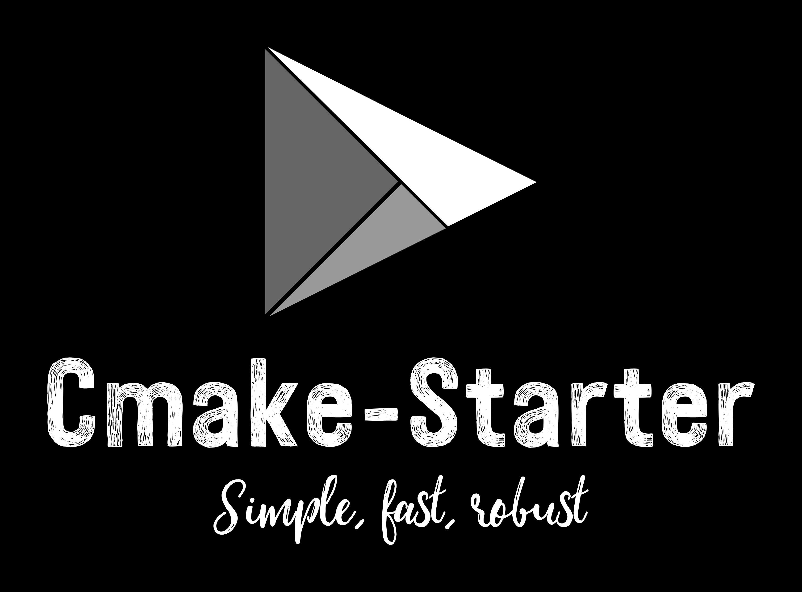

<div align="center">
  
</div>

<br>
<div align="center">
  
  
  
  
  
  
  
  
  
</div>

## :information_source: About 

> A lightweight Cmake project that uses CPM as its package manager. There are many
> CMake starter kits out there, this one focuses on a Linux environment only, there is no
> support for Windows or MacOs built in. The entire system assumes a Linux Environment,
> BSD support maybe added in the future.

1. [CPM -- The missing package manager for CMake](https://github.com/cpm-cmake/CPM.cmake)
  - CPM was chosen because it is simple to set up, dependency free, and is a simple wrapper around
    Cmakes FetchContent. Most other package managers like Hunter or Conan are difficult to set up,
    make ci/cd pipelines even more difficult to set up than they already are, and have dependencies.
    
2. This templated project has 2 types of projects ready to go by default.
  - The `core` folder showcases how to set up a shared library in CMake
  - The `app` folder showcases a standard binary application which consumes the `core` shared library
  - If you just want to build a library, delete the `app` folder, and purge the CMakeLists.txt files of `app` specific code
  - IF you just want to build a regular ol' binary application, delete the `core` folder, and purge the CMakeLists.txt files or `core` specific code

## :building_construction: Development

### Compiling
> Standard cmake rules apply, the following commands should be made from the root of the project

1. `cmake -B build` Generate the make files, fetch build dependencies
2. `cmake --build build -j$(nproc)` Compile the code

### Using the `devkit` tool

`devkit` is a collection of python modules that perform common tasks
for developers and package maintainers. It has **zero** dependencies.
Just the vanilla python standard library. Python version >= 3.6 should
be fine.

```bash
# Run for all options
./devkit --help

# Get help for each subcommand
./devkit clang --help
./devkit package --help
./devkit compile --help

# For example if you want to use clang-format and cmake-format to format all
# files before a commit simply run the following, and all will be taken care of
./devkit clang --format

# If you want to run clang-tidy to statically analyze all your files before a commit
# simple run the following, and all will be taken care of
./devkit clang --lint

# If you want package the software for Debian derivatives, Redhat derivatives or slackware,
# simple run the following. (Note that that the software must be built and compiled first)
# After the command is done, a freshly made .deb .rpm or slack build will be in the
# `build` directory
./devkit package --name <your softwares name> --version <your softwares version>

# There is also a small helper utility for rapid compiling while developing,
# Note that the compile command does not modify CMake options, but only changes
# the `CMAKE_CXX_COMPILER` and `CMAKE_C_COMPILER` option

# compile with the clang toolchain
./devkit compile --clang

# compile with the gnu toolchain
./devkit compile --gnu
```

### Modifying `devkit` for your project

The clang toolchain and gnu toolchain can have different names
on different distros depending on how you choose to install it,
for example maybe you want to install and use the latest version of `clang-format`,
the program maybe called `clang-format-13`, for this reason `devkit` as a settings file
used for configuration.

> To modify the cmake toolchain options, open the `tooling/settings.py` file
> and edit the `CMAKE_PROGRAMS` dictionary.

```python
CMAKE_PROGRAMS: Dict[str, Dict[str, str]] = {
    # cmake is here incase a different version is being used,
    # using flags should not be necessary
    "CMAKE": {
        "name": "cmake",
        "flags": "",
    },
    # customize formatting and clang tidy through the flags
    "CLANG_FORMATTER": {
        "name": "clang-format",
        "flags": "-i"
    },
    "CMAKE_FORMATTER": {
        "name": "cmake-format",
        "flags": "-i"
    },
    "CLANG_ANALYZER": {
        "name": "clang-tidy",
        "flags": f"-p {PROJECT_BUILD_DIR} --config-file={PROJECT_ROOT / '.clang-tidy'}"
    },
    # modify your compiler versions here, flags should not be necessary
    "CLANG_CXX_COMPILER": {
        "name": "clang++",
        "flags": "",
    },
    "CLANG_C_COMPILER": {
        "name": "clang",
        "flags": "",
    },
    "GNU_CXX_COMPILER": {
        "name": "g++",
        "flags": "",
    },
    "GNU_C_COMPILER": {
        "name": "gcc",
        "flags": "",
    }
}
```

> To modify the packaging options, open the `tooling/settings.py` file
> and edit the `PACKAGE_CONFIG` dictionary.

```python
PACKAGE_CONFIG: Dict[str, str] = {
    "BACKEND": "checkinstall",
    "LICENSE": "GPL-3.0",
    "MAINTAINER": "mattcoding4days",
    "REQUIRES": "",
    "RELEASE": f"{distro.codename()}-{distro.version()}"
}
```

> If there are files you don't want to format, or that you don't want to
> analyze add them to ignore lists. open the `tooling/settings.py`
> and edit the following

```python
# Files that should be ignored for formatting (clang-format, cmake-format)
FORMAT_IGNORE: List[Path] = [
    PROJECT_ROOT / 'app' / 'src' / 'example_file.cpp',
    PROJECT_ROOT / 'app' / 'src' / 'some_other_file.cpp'
]

# Files that should be ignored for clang-tidy
ANALYZE_IGNORE: List[Path] = [
    PROJECT_ROOT / 'app' / 'src' / 'example_file.cpp',
    PROJECT_ROOT / 'app' / 'src' / 'some_other_file.cpp'
]
```

> To see all the build details, read the [Dockerfile](https://github.com/mattcoding4days/cmake-starter/blob/main/Dockerfile) for a full
> Ubuntu 20.04 development environment

### :warning: Gotchas

> Specifics to be aware of when modifying for your own use

1. Each project has a variable named `PACKAGE_NAME`, the name of this variable
   must match the `include/<package_name>` folder.
   - e.g `core/CMakeLists.txt` PACKAGE_NAME=starter_core.
     The include folder which has all the header files for the `core` project
     is as follows: `core/include/starter_core`. If these do not match, the build will fail.
     
2. Each project **must** have a `version.hpp` file. This is to make versioning simple, you only need
   to change the version in one place. See the `cmake/utils.cmake` script to understand how this works.
     
## :computer: Docker

1. Build.Dockerfile builds and runs all tests in the project, simulates a ci/cd pipeline
2. Remote-Dev.Dockerfile is for remote development through Clion or vscode

### :keyboard: Commands

#### Running the Build.Dockerfile

> This image is for running tests, simulates what would happen in a ci/cd pipeline

```bash
# Build the container (can be used to rebuild image after code changes)
# [e.g] docker image build -t <image-name>:<tag> -f dev_containers/<file>.Dockerfile .
docker image build -t starter:v0.1 -f dev_containers/Build.Dockerfile .

# Rebuild with no cache
docker image build --no-cache -t starter:v0.1 -f dev_containers/Build.Dockerfile.

# Run the container interactively
# [e.g] docker container run -it <image-name>:<tag>
docker container run -it starter:v0.1

# Run non interactively
docker container run starter:v0.1
```

#### Running Remote-Dev.Dockerfile

> Follow this [Clion Docker tutorial](https://blog.jetbrains.com/clion/2020/01/using-docker-with-clion/) to set up your environment to connect to this container.
> Follow this [Clion Full remote mode ](https://www.jetbrains.com/help/clion/remote-projects-support.html) to set up Clion for remote development.

```bash
# Build the image
docker build -t starter/remote-cpp-env:0.1 -f dev_containers/Remote-Dev.Dockerfile .

# Once built you can run the container
docker run -d --cap-add sys_ptrace -p127.0.0.1:2222:22 --name starter_remote_env starter/remote-cpp-env:0.1

# Ports are temporarily mapped, and maybe reused, its usually worth clearing
# any cached ssh keys
ssh-keygen -f "$HOME/.ssh/known_hosts" -R "[localhost]:2222"
```
> When setting up the ssh credentials in your Editor you will need the following information,
> to connect to your newly created docker container.

1. SSH port: 2222
2. Username: user
3. Password: password

## :package: 3rd party packages

1. [gtest](https://github.com/google/googletest)
  - Googles Unit test framework which also includes a mock library
  - Why? It compiles way faster than catch2, has a built-in mocking framework, and blends nicely
    with the Google benchmark library
